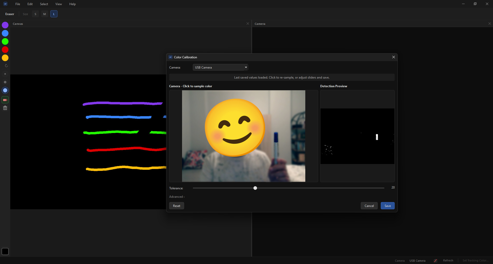

# Virtual Paint

A webcam-based virtual painting application. Hold a colored object in front of your camera and use it as a drawing tool on a virtual canvas overlaid on the live feed.



## Requirements

- Python 3.10+
- Webcam

## Installation

```bash
python -m venv .venv
.venv\Scripts\activate        # Windows
# source .venv/bin/activate   # macOS / Linux

pip install -r requirements.txt
```

## Running

```bash
python main.py
```

## How It Works

1. Launch the app. The camera feed appears on the right panel, the canvas on the left.
2. Click **Set Tracking Color...** in the status bar and click on your tracking object in the calibration dialog to sample its color.
3. Adjust tolerance as needed, then save. The app begins tracking the object immediately.
4. Move the object in front of the camera to draw on the canvas.

## Features

- **HSV color tracking** - click-to-sample calibration with tolerance and advanced H/S/V sliders
- **Virtual toolbar** - semi-transparent overlay at the top of the camera feed; hover a tool for 0.8 s to select it
- **5 drawing colors** - customizable by re-clicking the active swatch
- **3 brush sizes** - Small, Medium, Large
- **Eraser** - fills with the canvas background color
- **Undo / Redo** - up to 50 steps
- **Canvas background color** - any color; compositing adapts automatically
- **Hold Space to pause drawing** - prevents accidental strokes
- **Detection rectangle** - optional bounding box overlay on the tracked object
- **Save canvas** - PNG or JPG, timestamped filename by default
- **Persistent settings** - active color, size, background, and calibration survive restarts

## Keyboard Shortcuts

| Action | Shortcut |
|---|---|
| Color 1 - 5 | `1` `2` `3` `4` `5` |
| Brush Small | `J` |
| Brush Medium | `K` |
| Brush Large | `L` |
| Eraser | `E` |
| Clear Canvas | `C` `C` |
| Undo | `Ctrl+Z` |
| Redo | `Ctrl+Y` |
| Save | `Ctrl+S` |
| Pause Drawing | `Space` (hold) |

## Project Structure

```
virtual-paint/
├── main.py                     # Entry point
├── requirements.txt
└── src/
    ├── config.py               # Constants, asset paths, color palette
    ├── camera.py               # Camera open / read / enumerate
    ├── tracker.py              # HSV detection, tip and bounding rect
    ├── painter.py              # Canvas drawing, undo/redo, compositing
    └── ui/
        ├── main_window.py      # Main window, toolbars, menus, status bar
        ├── paint_widget.py     # Camera thread, frame pipeline, canvas display
        ├── virtual_toolbar.py  # In-frame overlay toolbar
        └── calibration_dialog.py  # HSV calibration dialog
```

## Stack

Python - PySide6 - OpenCV - NumPy
